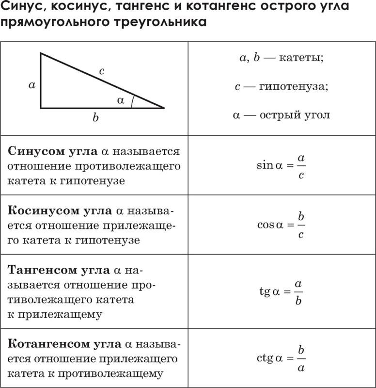

<body id="main">

Включить тёмную тему

Тригонометрия — раздел математики, в котором изучаются зависимости между величинами углов и длинами сторон треугольников, а также алгебраические тождества тригонометрических функций.

 

<ul>
<li class="masthead__menu-item"> <a href="https://cvtqwert.github.io/TrigoChit/page1.html">Таблица значений основных тригонометрических функций</a> </li>
<li class="masthead__menu-item">          <a href="https://cvtqwert.github.io/TrigoChit/page2.html">Тригонометрические формулы</a> </li>
 <li class="masthead__menu-item">         <a href="https://cvtqwert.github.io/TrigoChit/page3.html">Графики тригонометрических функций</a> </li>
        
</ul>

</body>

